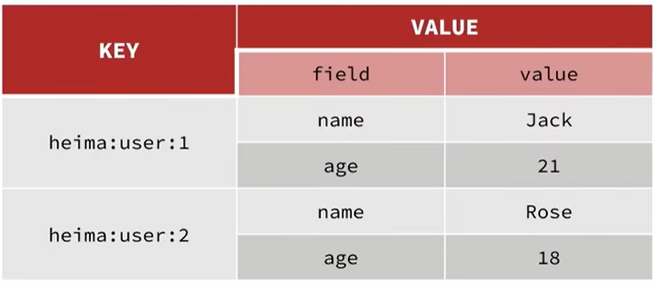

# Hash

`hash` 就像字典、对象一样，可以存储不同的键值对



常用命令

| 命令                    | 说明                                                         |
|-----------------------| ------------------------------------------------------------ |
| [`HSET`](#hset)       | 创建或修改哈希中字段的值。                                   |
| [`HGET`](#hget)       | 返回哈希中字段的值。                                         |
| [`HDEL`](#hdel)       |  从哈希中删除一个或多个字段及其值。如果没有剩余字段，则删除哈希。 |
| [`HMSET`](#hmset)     | 设置多个字段的值。                                           |
| [`HMGET`](#hmget)     | 返回哈希中多个字段的值。                                     |
| [`HGETALL`](#hgetall) | 返回哈希中的所有字段及其值。                                 |
| [`HKEYS`](#hkeys)     | 返回哈希中的所有字段。                                       |
| [`HVALS`](#hvals)     | 返回哈希中的所有值。                                         |
| [`HINCRBY`](#hincrby) | 将哈希中字段的整数值增加一个数字。如果字段不存在，则使用0作为初始值。 |
| [`HSETNX`](#hsetnx)   | 仅在字段不存在时设置哈希中字段的值。                         |


## HSET

创建或修改哈希中字段的值。

可以设置多个，类似与 [HMSET](#HMSET)。 只是返回结果不同。

> [!CAUTION] 注意！
>
> 哈希内的字段，不可以使用 `GET` 来获取
>
> 会报错：`(error) WRONGTYPE Operation against a key holding the wrong kind of value`

### 命令

```shell
help HSET                                                               
                                                                                        
  HSET key field value [field value ...]                                                
  summary: Creates or modifies the value of a field in a hash.                          
  since: 2.0.0                                                                          
  group: hash  
```

### 示例1

```shell
# 设定一个用户，filed 为 name 值为 emma
HSET user1 name emma
(integer) 1

# 修改 user1 的 name 为 caden
HSET user1 name caden
(integer) 1

# 查看
KEYS *
1) "user1"
```

### 示例2

```shell
# 设定新增 user1 name 为 emma， age 为 12
HSET user1 name emma age 12
(integer) 2

# 查看 user1 的 fileds
HKEYS user1
1) "name"
2) "age"
```


## HGET

返回哈希中字段的值。

### 命令

```shell
help HGET                                                               
                                                                                        
  HGET key field                                                                        
  summary: Returns the value of a field in a hash.                                      
  since: 2.0.0                                                                          
  group: hash
```

### 示例

```shell
# 设定一个用户，filed 为 name 值为 emma
HSET user1 name emma
(integer) 1

# 获取 key 为 user 的 name
HGET user1 name
"emma"
```


## HDEL

从哈希中删除一个或多个字段及其值。如果没有剩余字段，则删除哈希。

> [!WARNING] 注意
>
> 如果删除了所有字段则这个 hash 会被删除

### 命令

```shell
help HDEL                                                               
                                                                                        
  HDEL key field [field ...]                                                            
  summary: Deletes one or more fields and their values from a hash. Deletes the hash if 
no fields remain.                                                                       
  since: 2.0.0                                                                          
  group: hash
```

### 示例

```shell
# 设定 user1 name 为 emma, age 为 12, gender 为 boy
HMSET user1 name emma age 12 gender boy
OK

# 删除 user1 name
HDEL user1 name
(integer) 1

# 删除 user1 age gender
HDEL user1 age gender
(integer) 2

# 查看所有 keys
KEYS *
(empty array)
```


## HMSET

设置多个字段的值。

[`HSET`](#HSET) 也可以做到这一点。返回结果不同。

### 命令

```shell
help HMSET                                                              
                                                                                        
  HMSET key field value [field value ...]                                               
  summary: Sets the values of multiple fields.                                          
  since: 2.0.0                                                                          
  group: hash
```

### 示例

```shell
# 设定 user1 name 为 emma, age 为 12, gender 为 boy
HMSET user1 name emma age 12 gender boy
OK

# 查看
HGETALL user1
1) "name"
2) "emma"
3) "age"
4) "12"
5) "gender"
6) "boy"
```


## HMGET

返回哈希中多个字段的值。

### 命令

```shell
help HMGET                                                              
                                                                                        
  HMGET key field [field ...]                                                           
  summary: Returns the values of all fields in a hash.                                  
  since: 2.0.0                                                                          
  group: hash
```

### 示例

```shell
# 设定 user1 name 为 emma, age 为 12, gender 为 boy
HMSET user1 name emma age 12 gender boy
OK

# 获取 user1 多个字段 name age
HMGET user1 name age
1) "emma"
2) "12"
```


## HGETALL

返回哈希中的所有字段及其值。

### 命令

```shell
help HGETALL                                                            
                                                                                        
  HGETALL key                                                                           
  summary: Returns all fields and values in a hash.                                     
  since: 2.0.0                                                                          
  group: hash
```

### 示例

``` shell
# 设定 user1 name 为 emma, age 为 12, gender 为 boy
HMSET user1 name emma age 12 gender boy
OK

# 查看 user1 所有 field value
HGETALL user1
1) "name"
2) "emma"
3) "age"
4) "12"
5) "gender"
6) "boy"
```


## HKEYS

返回哈希中的所有字段。

### 命令

```shell
help HKEYS                                                              
                                                                                        
  HKEYS key                                                                             
  summary: Returns all fields in a hash.                                                
  since: 2.0.0                                                                          
  group: hash
```

### 示例

```shell
# 设定 user1 name 为 emma, age 为 12, gender 为 boy
HMSET user1 name emma age 12 gender boy
OK

# 查看 user1 所有 keys
HKEYS user1
1) "name"
2) "age"
3) "gender"
```


## HVALS

返回哈希中的所有值。

### 命令

```shell
help HVALS                                                              
                                                                                        
  HVALS key                                                                             
  summary: Returns all values in a hash.                                                
  since: 2.0.0                                                                          
  group: hash
```

### 示例

```shell
# 设定 user1 name 为 emma, age 为 12, gender 为 boy
HMSET user1 name emma age 12 gender boy
OK

# 查看 user1 所有 value
HVALS user1
1) "emma"
2) "12"
3) "boy"
```


## HINCRBY

将哈希中字段的整数值增加一个数字。如果字段不存在，则使用0作为初始值。

如果不是 `number` 类型，则报错：`(error) ERR hash value is not an integer`

### 命令

```shell
help HINCRBY                                                            
                                                                                        
  HINCRBY key field increment                                                           
  summary: Increments the integer value of a field in a hash by a number. Uses 0 as init
ial value if the field doesn't exist.                                                   
  since: 2.0.0                                                                          
  group: hash
```

### 示例

```shell
# 设定 user1 name 为 emma, age 为 12, gender 为 boy
HMSET user1 name emma age 12 gender boy
OK

# 给 age + 5
HINCRBY user1 age 5
(integer) 17

# 查看所有
HGETALL user1
1) "name"
2) "emma"
3) "age"
4) "17"
5) "gender"
6) "boy"
```


## HSETNX

仅在字段不存在时设置哈希中字段的值。

### 命令

```shell
help HSETNX                                                             
                                                                                        
  HSETNX key field value                                                                
  summary: Sets the value of a field in a hash only when the field doesn't exist.       
  since: 2.0.0                                                                          
  group: hash
```

### 示例

```shell
# 设定 user1 name 为 emma, age 为 12, gender 为 boy
HMSET user1 name emma age 12 gender boy
OK

# 如果存在，则不动，例：新增 user1 的 name 为 caden
HSETNX user1 name caden
(integer) 0

# 如果不存在，则新增，例：新增 user1 的 hobby 为 eat
HSETNX user1 hobby eat
(integer) 1

# 查看结果
HGETALL user1
1) "name"
2) "emma"
3) "age"
4) "12"
5) "gender"
6) "boy"
7) "hobby"
8) "eat"
```