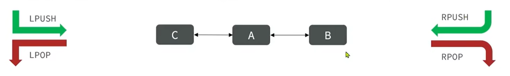

# List

经常用来存储一些有序数据。


- 有序
- 元素可以重复


## 常用命令

**列表为 先入后出，后入先出**



| 命令                  | 说明                                                         |
|---------------------| ------------------------------------------------------------ |
| [`LPUSH`](#lpush)   | 将一个或多个元素添加到列表的开头。如果键不存在，则创建该键。 |
| [`RPUSH`](#rpush)   | 将一个或多个元素添加到列表的末尾。如果键不存在，则创建该键。 |
| [`LPOP`](#lpop)     | 返回列表中的第一个元素并将其删除。如果最后一个元素被弹出，则删除该列表。 |
| [`RPOP`](#rpop)     | 返回并删除列表中的最后一个元素。如果最后一个元素被弹出，则删除该列表。 |
| [`LLEN`](#llen)     | 返回列表的长度。                                             |
| [`LREM`](#lrem)     | 从列表中删除匹配的元素。如果最后一个元素被删除，则删除该列表。 |
| [`LRANGE`](#lrange) | 返回列表中的一系列元素。                                     |
| [`BLPOP`](#blpop)   | 删除并返回列表中的第一个元素。如果没有元素可用，则会阻塞。若最后一个元素被弹出，则删除该列表。 |
| [`BRPOP`](#brpop)   | 删除并返回列表中的最后一个元素。如果没有元素可用，则会阻塞。若最后一个元素被弹出，则删除该列表。 |


## LPUSH

将一个或多个元素添加到列表的开头。如果键不存在，则创建该键。

### 命令

```shell
help LPUSH                                                              
                                                                                        
  LPUSH key element [element ...]                                                       
  summary: Prepends one or more elements to a list. Creates the key if it doesn't exist.
  since: 1.0.0                                                                          
  group: list
```

### 示例

``` shell
# 新增一个列表为 eng [a,b,c,d,e]
LPUSH eng a b c d e
(integer) 5

# 查看
LRANGE eng 0 -1
1) "e"
2) "d"
3) "c"
4) "b"
5) "a"
```


## RPUSH

将一个或多个元素添加到列表的末尾。如果键不存在，则创建该键。

### 命令

```shell
help RPUSH                                                              
                                                                                        
  RPUSH key element [element ...]                                                       
  summary: Appends one or more elements to a list. Creates the key if it doesn't exist. 
  since: 1.0.0                                                                          
  group: list
```

### 示例

```shell
# 新增一个列表为 eng [a,b,c,d,e]
LPUSH eng a b c d e
(integer) 5

# 向列表最后新增一个 f
RPUSH eng f
(integer) 6

# 查看
LRANGE eng 0 -1
1) "e"
2) "d"
3) "c"
4) "b"
5) "a"
6) "f"
```


## LPOP

返回列表中的第一个元素并将其删除。如果最后一个元素被弹出，则删除该列表。

- `count`：要删除的个数

### 命令

```SHELL
help LPOP                                                               
                                                                                        
  LPOP key [count]                                                                      
  summary: Returns the first elements in a list after removing it. Deletes the list if t
he last element was popped.                                                             
  since: 1.0.0                                                                          
  group: list
```

### 示例

```shell
# 新增一个列表为 eng [a,b,c,d,e]
LPUSH eng a b c d e
(integer) 5

# 删除列表左边第一个
LPOP eng
"e"

# 删除列表左边开始 3 个
LPOP eng 3
1) "d"
2) "c"
3) "b"
```


## RPOP

返回并删除列表中的最后一个元素。如果最后一个元素被弹出，则删除该列表。

- `count`：要删除的个数

### 命令

```shell
help RPOP                                                               
                                                                                        
  RPOP key [count]                                                                      
  summary: Returns and removes the last elements of a list. Deletes the list if the last
 element was popped.                                                                    
  since: 1.0.0                                                                          
  group: list
```

### 示例

``` shell
# 新增一个列表为 eng [a,b,c,d,e]
LPUSH eng a b c d e
(integer) 5

# 删除右边第一个
RPOP eng 
"a"


# 删除右边三个
RPOP eng 3
1) "b"
2) "c"
3) "d"
```


## LLEN

返回列表的长度。

### 命令

```shell
help LLEN                                                               
                                                                                        
  LLEN key                                                                              
  summary: Returns the length of a list.                                                
  since: 1.0.0                                                                          
  group: list
```

### 示例

``` shell
# 新增一个列表为 eng [a a b b c c d e f g]
LPUSH eng a a b b c c d e f g
(integer) 10

# 查看长度
LLEN eng
(integer) 10
```

## LREM

从列表中删除元素。如果最后一个元素被删除，则删除该列表。

- `key`：要操作的列表的名称。
- `count`：要删除的元素数量：
    - 如果 `count` 为正，删除从头到尾的元素。
    - 如果 `count` 为负，删除从尾到头的元素。
    - 如果 `count` 为 0，删除列表中所有匹配的元素。
- `element`：要删除的元素的值。

### 命令

```shell
help LREM                                                               
                                                                                        
  LREM key count element                                                                
  summary: Removes elements from a list. Deletes the list if the last element was remove
d.                                                                                      
  since: 1.0.0                                                                          
  group: list 
```

### 示例

``` shell
# 新增一个列表为 eng [a a b b c c d e f g]
LPUSH eng a a b b c c d e f g
(integer) 10

# 删除所有的 a
LREM eng 0 a
(integer) 2

# 删除一个 b
LREM eng 1 b
(integer) 1

# 查看列表
LRANGE eng 0 -1
1) "g"
2) "f"
3) "e"
4) "d"
5) "c"
6) "c"
7) "b"
```


## LRANGE

返回列表中的一系列元素。

### 命令

```shell
help LRANGE                                                             
                                                                                        
  LRANGE key start stop                                                                 
  summary: Returns a range of elements from a list.                                     
  since: 1.0.0                                                                          
  group: list
```

### 示例

```shell
# 新增一个列表为 eng [a a b b c c d e f g]
LPUSH eng a a b b c c d e f g
(integer) 10

# 查看所有
LRANGE eng 0 -1
 1) "g"
 2) "f"
 3) "e"
 4) "d"
 5) "c"
 6) "c"
 7) "b"
 8) "b"
 9) "a"
10) "a"

# 查看 0-4 的 5 个
LRANGE eng 0 4
1) "g"
2) "f"
3) "e"
4) "d"
5) "c"
```


## BLPOP

删除并返回列表中的第一个元素。**如果没有元素可用，则会阻塞。**若最后一个元素被弹出，则删除该列表。

### 命令

```shell
help BLPOP                                                              
                                                                                        
  BLPOP key [key ...] timeout                                                           
  summary: Removes and returns the first element in a list. Blocks until an element is a
vailable otherwise. Deletes the list if the last element was popped.                    
  since: 2.0.0                                                                          
  group: list
```

### 示例

需要的时候再学习


## BRPOP

删除并返回列表中的最后一个元素。**如果没有元素可用，则会阻塞。**若最后一个元素被弹出，则删除该列表。

### 命令

```
help BRPOP                                                              
                                                                                        
  BRPOP key [key ...] timeout                                                           
  summary: Removes and returns the last element in a list. Blocks until an element is av
ailable otherwise. Deletes the list if the last element was popped.                     
  since: 2.0.0                                                                          
  group: list
```

### 示例

需要的时候再学习


## 使用技巧

如何模拟一个栈？

- 入口出口在同一边。
- 使用 `LPUSH` 和 `LPOP` 或者 `RPUSH` 和 `RPOP`

如何模拟一个队列？

- 入口和出口在不同边
- 使用 `LPUSH` 和 `RPOP` 或者 `RPUSH` 和 `LPOP`

如何模拟一个阻塞队列？

- 使用 `LPUSH` 和 `BRPOP` 或者 `RPUSH` 和 `BLPOP`