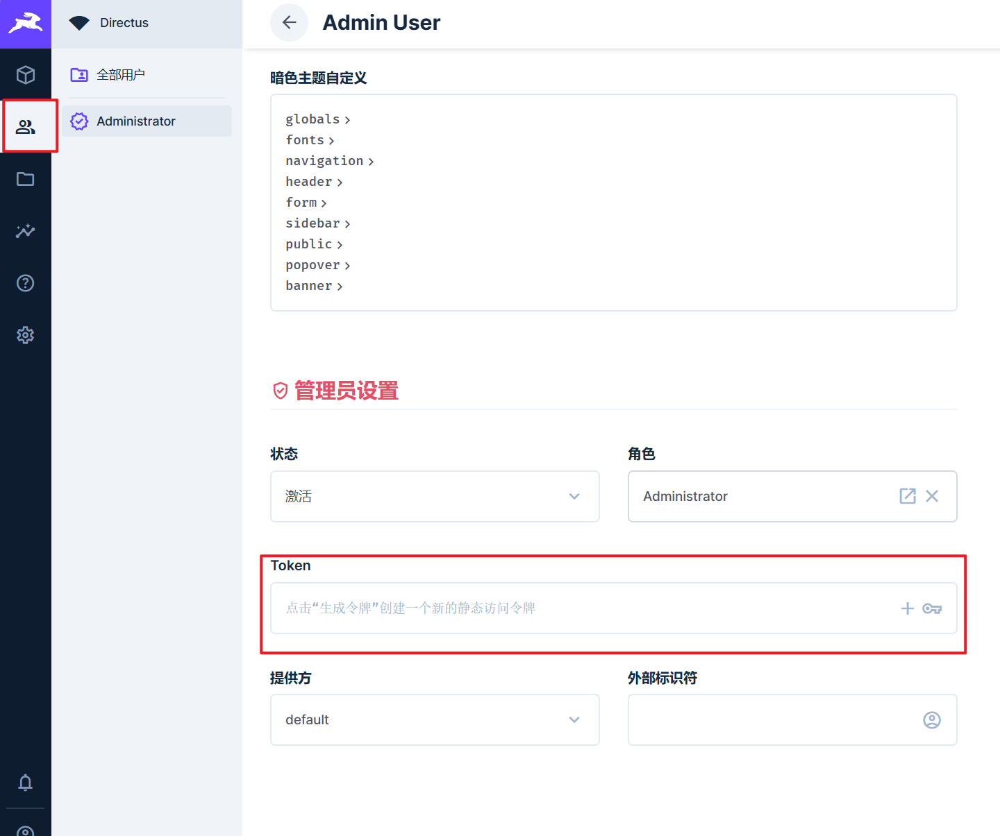

# 数据表

- [文档](https://docs.directus.io/guides/sdk/getting-started.html#making-requests)

``` typescript
import { 
    createDirectus,
    readItem,
    readItems,
    rest,
    createItem,
    updateItem,
    deleteItem
} from '@directus/sdk';

const client = createDirectus('http://xxx').with(rest())
```

## 查询项目

### 查询单个

[文档](https://docs.directus.io/reference/items.html#get-item-by-id)

``` typescript
await client.request(
    readItem('GoodsCats', 1)	// 这里传入的是 id
)
```


### 查询所有

``` typescript
await client.request(
    readItems('GoodsCats')
)
```


### 查询特定字段

``` typescript
await client.request(
    readItems('GoodsCats', {
        fields: ['id', 'title', 'sort']
    })
)
```


### 查询所有字段

或者不传也可以

``` typescript
await client.request(
    readItems('GoodsCats', {
        fields: ['*']
    })
)
```


### 查询嵌套字段

``` typescript
await client.request(
    readItems('GoodsCats', {
        fields: ['id','title', {parent_id:['id', 'title']}]
    })
)
```


### 自定义端点

注意这里的括号。

::: code-group

``` typescript [使用]
await client.request((() => ({
    path:'',
    method:'GET'
})))
```

``` typescript [类型]
interface RequestOptions {
    path: string;
    method?: HttpMethod;
    params?: Record<string, any>;
    headers?: Record<string, string>;
    body?: string | FormData;
    onRequest?: RequestTransformer;
    onResponse?: ResponseTransformer;
}
```

:::


## 新增项目

> [!warning]
>
> 需要在后台生成 token
>
> 

token 可后台生成: 8HieiqRJuYXA9A_Q7YIO4gGrF06tU5EG，[token 相关](https://docs.directus.io/guides/sdk/authentication.html#set-a-token)

### 新增单个

[文档](https://docs.directus.io/reference/items.html#create-an-item)

- 新增单个传入 **对象**
- 成功返回数据
- 失败直接报错

``` typescript
// 需要配置 token
const client = createDirectus('http://10.10.10.10:8055')
    .with(rest())
    .with(staticToken('kz73JxxwwiCNq9O5AVLaenpnf9NkXvYw')	// [!code ++]
    
// 操作
const cat: {
    title: string,
    summarize?: string | null
    sort?: number,
    parent_id?: number | null
} = {
    title: '这里是标题'
};          
          
await client.request(createItem('GoodsCats', cat))	// [!code ++]
```

### 新增多个

[文档](https://docs.directus.io/reference/items.html#create-multiple-items)

- 新增多个传入 **数组**
- 成功返回新增的数组
- 失败直接报错

> [!caution] 注意
>
> 后端使用了事务，也就是如果有一个新增失败，则都不会新增

```typescript
const cats:CAT[] = [{title:'t1'},{title:'t2'}];

await client.request(createItem('GoodsCats', cats))	// [!code ++]
```


## 更新项目

### 更新单个

[文档](https://docs.directus.io/reference/items.html#update-an-item)

- 成功返回修改后的数据
- 失败直接报错

`updateItem(collection_name, item_id, partial_item_object)`

``` typescript
await client.request(updateItem ('GoodsCats', 4, {title:'王二麻子'}))
```

### 更新多个

[文档](https://docs.directus.io/reference/items.html#update-multiple-items)

- 成功返回修改后的所有数据
- 失败直接报错

> [!warning] 注意
>
> 如果后台没有这个字段， 更新也不会报错。

`updateItems(collection_name, item_id_array, partial_item_object)`

``` typescript
await client.request(
    updateItems('GoodsCats', [1, 2, 3, 4, 5], { sort: 5 })
)
```

## 删除项目

### 删除单个

[文档](https://docs.directus.io/reference/items.html#delete-an-item)

- 成功什么也不返回
- 不成功会报错

> [!caution] 注意！
>
> - 如果找不到 `id` 同什么也不返回。
>
> - 如果后端有关联设置，会根据后端的关联设置进行删除
>     - 如果禁止删除，则删除时会报错。具体报错需要查看 `err.errors`

`deleteItem(collection_name, item_id)`

```
await client.request(
    deleteItem('GoodsCats', 1)
)
```


### 删除多个

[文档](https://docs.directus.io/reference/items.html#delete-multiple-items)

- 成功什么也不返回，如果找不到 `id` 同什么也不返回
- 不成功会报错

`deleteItems(collection_name, query_object)`


::: code-group

```typescript [Array]
await client.request(
    deleteItems('GoodsCats', [9, 10])	// [!code focus]
)
```


```typescript [高级查询]
await client.request(
    deleteItems('GoodsCats', {
        filter: {	// [!code focus:4]
            _eq: {
                sort: 5
            }
        }
    })
)
```

:::
