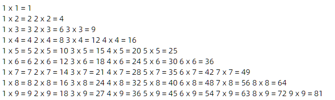

# 循环语句


## for

**`1-100`**

```javascript
for (let i = 1; i <= 100; i++) {
    console.log(i)
}
```

**`1+2+3...+100`**

```javascript
let result = 0
for (let i = 1; i <= 100; i++) {
    result += i
}
console.log(result)
```

## while

**`1-100`**

```javascript
let a = 1
while (a <= 100){
    console.log(a)
    a++
}
```

**`1+2+3...+100`**

```javascript
let a = 1
let b = 0
while (a <= 100){
    console.log(a)
    b+=a
    a++
}
console.log(b)
```


## do...while

**`1-100`**

``` javascript
let i = 1
do {
    console.log(i)
    i++
}while (i<=100)
```


**`1+2+3...+100`**

```javascript
let i = 1
let b = 0
do {
    b+=i
    i++
}while (i<=100)

console.log(b)
```


## break

跳出循环

```javascript {10,20,29}
/*
* 到指定条件退出循环
* */

// for
let back = 10
for (let i = 0; i < 100; i++) {
    console.log(i)
    if (i === back)
        break
}


// while
let w = 0
while (true) {
    w++
    console.log(w)
    if (w === back)
        break
}

// do...while...
let d = 0
do {
    d++
    console.log(d)
    if (d === back)
        break
} while (true)
```


## continue

跳出本次循环，执行下次循环

```javascript {8,20,31}
/*
* 输出10以内的奇数
* */

// for
for (let i = 0; i < 11; i++) {
    if (i % 2 === 0)
        continue
    console.log(i)
}


// while
let w = 0
while (true) {
    w++
    if (w > 10)
        break
    if (w %2 === 0)
        continue
    console.log(w)
}

// do...while...
let d = 0
do {
    d++
    if (d > 10)
        break
    if (d %2 === 0)
        continue
    console.log(d)
} while (true)
```


## 案例

**`假设银行年利率为 5% , 1000 块，存多少年变成 5000 块`**

```javascript
/*
* 假设银行年利率为 5% , 1000 块，存多少年变成 5000 块
* */

// 用 while
let amount = 1000
let years = 0
while (true) {
    amount *= 1.05
    years++
    if (amount >= 5000) {
        break
    }
}
console.log(years, `金额为：${amount}`)  // 33 金额为：5003.18854203379


// 用 for
let year1 = 0
let amount2 = 0
for (let i = 1000; i <= 5000;) {
    i *= 1.05
    amount2 = i
    year1++
}
console.log(year1, `金额为：${amount2}`)  // 33 金额为：5003.18854203379

// 用 do while
let year2 = 0
let amount3 = 1000
do {
    amount3 *= 1.05
    year2++
} while (amount3 <= 5000)
console.log(year2, `金额为：${amount3}`)  // 33 金额为：5003.18854203379
```


**`99乘法表`**

```javascript
for (let i = 1; i < 10; i++) {
    for (let j = 1; j < 10; j++) {
        if (j <= i){
            document.write(`${j} x ${i} = ${i * j}   `)
        }
    }
    document.write('<br>')
}
```




