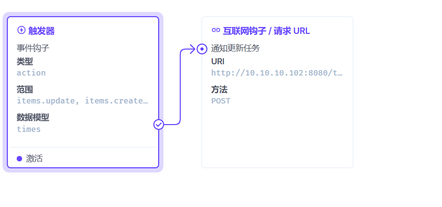

# 其他常用库

- [luxon](https://luxon.nodejs.cn/) 时间库
- [radash](https://www.radash.wiki/) 函数库，类似 ladash
- [cron](https://www.npmjs.com/package/cron) 定时执行任务
- [qrcode](https://www.npmjs.com/package/qrcode) 生成二维码
- [html-to-image](https://www.npmjs.com/package/html-to-image) 网页生成图片. 更轻量 [下载保存](#html-to-image)
- [modern-screenshot](https://github.com/qq15725/modern-screenshot/blob/HEAD/README.zh-CN.md) 理论上是封装的 html-to-image。但是能保证 IOS 图片嵌入问题 (#html-to-image)
- [html2canvas-pro](https://www.npmjs.com/package/html2canvas-pro) 截图，兼容性更强个屁 [下载保存](#html2canvas)
- [vue-watermark](https://www.npmjs.com/package/@watermarkify/vue-watermark) 水印库


## Luxon 常用代码片段

### 从字符串解析出时间

```ts
import { DateTime } from "luxon";

const time = '15:23'

const t = DateTime.fromFormat(time, 'HH:mm')

if (t.isValid) {
    const h = t.hour
    const m = t.minute
    console.log(h, m);
} else {
    console.log('无效的格式时间');
}
```


## cron 代码片段

### cron 如何动态更新任务？

```ts
const cronMap = new Map()

const createJob = async (times: string[]) => {
    return times.map(time => {
        const job = CronJob.from({
            cronTime: time,
            onTick: async () => {
                console.log('创建的任务~')
            },
            timeZone: 'Asia/Shanghai',
        })
        cronMap.set(time, job)
        job.start()
        return job
    })
}

// 创建一个网络钩子，每次时间更新，然后调用这个函数。
const reCreateJob = async (times: string[]) => {
    cronMap.forEach((job) => {
        job.stop()  // 停止. 必须要做的，不然会有很多之前的任务没有清空
    })

    cronMap.clear() // 清空

    await createJob(times)  // 创建
}
```

如果使用的是 `directus` 那么直接在流程中创建一个钩子即可



## html2canvas


```ts
import { saveAs } from 'file-saver';
import html2canvas from 'html2canvas-pro';

export default async (html: HTMLElement) => {
    const res = await html2canvas(html, {
        windowWidth: 750,
        useCORS: true,

    })
    res.toBlob(blob => {
        if (blob) saveAs(blob, 'myReport.png')
    })
}
```


## html-to-image

```ts
import { toPng, toBlob, toPixelData } from "html-to-image";
import { saveAs } from 'file-saver';

export default async (html: HTMLElement) => {
    await new Promise((resolve) => setTimeout(resolve, 2000));
    const res = await toBlob(html, {
        quality: 1,
        pixelRatio: 5,// 像素比, 或者以 2 倍分辨率 渲染，图片更清晰。
        skipAutoScale: true
    })
    if (res) saveAs(res, 'myReport.png');
}
```
