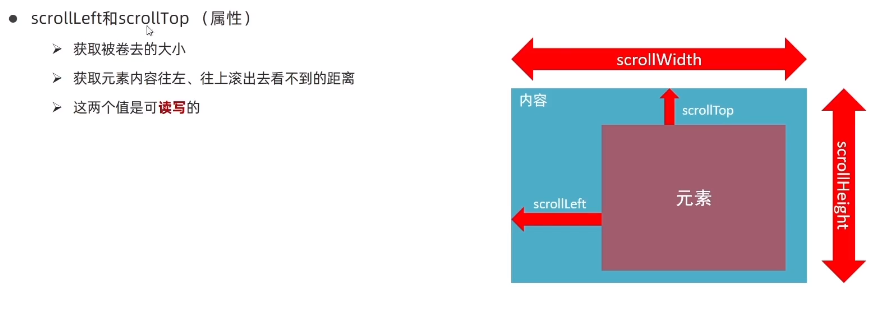

# 事件监听

三要素

- **事件源**：哪个 `DOM` 对象被某个事件触发了，要获取 `DOM` 元素
- **事件类型**：什么方式触发？`click`、`mouseover` ...
- **事件调用函数**：要做什么事

``` javascript
element.addEventListener('事件类型',要执行的函数)
```


## 简单开始

```html
<body>
    <button>点我，弹窗</button>
</body>

<script>
    const btn = document.querySelector('button')
    btn.addEventListener('click', ()=>{
        alert('弹弹弹，弹走鱼尾纹')
    })
</script>
```


## 事件类型

| 事件类型                     | 说明                                                         |
| ---------------------------- | ------------------------------------------------------------ |
| **click**                    | 当鼠标左键点击时触发，适用于大多数元素。                     |
| **dblclick**                 | 当鼠标左键双击时触发。                                       |
| **mousedown**                | 当鼠标按钮被按下时触发。                                     |
| **mouseup**                  | 当鼠标按钮被释放时触发。                                     |
| **mousemove**                | 当鼠标指针在元素内移动时触发。                               |
| **mouseover**                | 当鼠标指针位于元素上方时触发，也会在子元素上触发多次。       |
| **mouseout**                 | 当鼠标指针移出元素时触发，也会在子元素上触发多次。           |
| **keydown**                  | 当键盘上的键被按下时触发。                                   |
| **keyup**                    | 当键盘上的键被释放时触发。                                   |
| **keypress**                 | 当键盘上的键被按下并立即释放时触发，通常用于捕捉字符输入。   |
| **change**                   | 在 `<input>`, `<select>`, 和 `<textarea>` 元素的值发生改变时触发，常用于表单元素。 |
| **input**                    | 在 `<input>`, `<select>`, 和 `<textarea>` 元素的值发生任何变化时触发，实时监听输入。 |
| **submit**                   | 当表单提交时触发。                                           |
| **focus**                    | 当元素获得焦点时触发。                                       |
| **blur**                     | 当元素失去焦点时触发。                                       |
| **scroll**                   | 当元素滚动时触发，适用于有滚动条的元素。                     |
| **load**                     | 当页面或元素完成加载时触发，适用于``, `<script>`, `<link>`, 等。 |
| **unload**                   | 当页面或元素即将被卸载时触发。                               |
| **resize**                   | 当窗口或元素的大小发生改变时触发。                           |
| **mouseenter**               | 当鼠标指针进入元素区域时触发，不会在子元素进入时触发。       |
| **mouseleave**               | 当鼠标指针离开元素区域时触发，不会在子元素离开时触发。       |
| **contextmenu**              | 当鼠标右键点击时触发。                                       |
| **dragstart**, **dragend**   | 用于拖动操作的开始和结束时触发。                             |
| **drop**                     | 当元素或选中的文本被拖放到目标位置时触发。                   |
| **touchstart**, **touchend** | 触摸屏设备上手指接触和离开屏幕时触发。                       |


## 事件冒泡

当一个元素触发后，会依次向上调用所有父级元素的 **同名事件**

### 事件冒泡

```html
<body>
    <div>
        点击子标签会触发父标签的 事件，这就是冒泡
    </div>

    <div class="father">
        我是父标签
        <div class="son">我是子标签</div>
    </div>
</body>

<script>
    // father 事件
    const father = document.querySelector('.father')
    father.addEventListener('click', () => {
        alert('我是 father 事件')
    })

    // son 事件
    const son = document.querySelector('.son')
    son.addEventListener('click', () => {
        alert('我是 son 事件')
    })
</script>
```

### 阻止冒泡

阻止事件冒泡需要拿到事件对象

``` javascript
事件对象.stopPropagation()
```

```html
<body>
    <div>
        点击子标签会触发父标签的 事件，这就是冒泡
    </div>

    <div class="father">
        我是父标签
        <div class="son">我是子标签</div>
    </div>
</body>

<script>
    // father 事件
    const father = document.querySelector('.father')
    father.addEventListener('click', () => {
        alert('我是 father 事件')
    })

    // son 事件
    const son = document.querySelector('.son')
    son.addEventListener('click', (e) => {
        alert('我是 son 事件')
        e.stopPropagation()	// [!code ++]
    })
</script>
```


## 事件对象

```html {7-9}
<body>
    <button>点我获取事件对象</button>
</body>

<script>
    const btn = document.querySelector('button')
    btn.addEventListener('click', (e)=>{
        console.log("事件对象：",e)
    })
</script>
```


### 示例

```html
<body>
    <input placeholder="选中我，然后随便按个键盘按键" style="width: 100%"/>
    <div>你按下的是：<span class="one"></span></div>
    <div>你按下的键值是：<span class="two"></span></div>
</body>

<script>
    const ipt = document.querySelector('input')
    const one = document.querySelector('.one')
    const two = document.querySelector('.two')
    ipt.addEventListener('keydown', (e) => {
        one.innerText = e.code
        two.innerText = e.key
        console.log("事件对象：", e)
    })
</script>
```


## 事件委托

利用冒泡和事件对象，简化操作

- 为父标签绑定事件，
- 通过事件对象 `event.target` 获取到子标签，然后处理样式等操作

```html {25}
<body>
    <div>
        只给 ul 加事件，然后点击 li ，相应的 li 颜色变为红色
    </div>

    <ul>
        <li>点我</li>
        <li>点我</li>
        <li>点我</li>
        <li>点我</li>
        <li>点我</li>
    </ul>


</body>

<script>
    const ul = document.querySelector('ul')
    ul.addEventListener('click',(event)=>{	// 获取到事件对象并且使用 .target 进行委托
        // 清除 ul 下所有的 li color
        for (const li of ul.children) {
            li.style.color = ''
        }

        event.target.style.color = 'red'    // 修改点击的 li 为 red
    })
</script>
```


## 阻止默认行为

```html {8}
<body>
    <a href="https://www.baidu.com">跳转不出去，别点了！</a>
</body>

<script>
    const a = document.querySelector('a')
    a.addEventListener('click', (ev)=>{
        ev.preventDefault()     // 阻止默认行为
    })
</script>
```


## 加载事件

### 整体页面资源

整个资源，包括任何图片等资源...

要加到 `header` 里

```html
<head>
    <meta charset="UTF-8">
    <title>Document</title>
    <script>
        // 图片等...所有资源
        window.addEventListener('load', () => {
            console.log('加载成功！')
        })
    </script>
</head>
<body>
    <div>页面加载事件，使用 window, 因为 window 比 document 还要大</div>
</body>
```


### Dom 资源

无需等待图片等资源加载完，只要 `DOM` 渲染完即执行回调函数

```html
<head>
    <meta charset="UTF-8">
    <title>Document</title>
    <script>
        document.addEventListener('DOMContentLoaded', () => {
            console.log('加载成功！')
        })
    </script>
</head>
<body>
    <div>页面加载事件，使用 window, 因为 window 比 document 还要大</div>
</body>
```


## 页面滚动事件



`.scrollTop` 是可读写的，也就是可以被赋值

`document.documentElement` 获取的是 `html` 标签

```html {15-19}
<body>
    <div>页面滚动事件</div>
    <div class="to-top" style="position: fixed; bottom: 10px; right: 10px; display: none">返回顶部</div>
    <div style="height: calc(2*100vh);"></div>
</body>
<script>
    const toTop = document.querySelector('.to-top')

    // 页面滚动事件
    window.addEventListener('scroll', () => {
        // document.documentElement 是 html 标签
        // console.log(document.documentElement.scrollTop) // 被卷去的高度

        // 如果页面被卷去 500, 那么显示 返回顶部, 否则隐藏
        if (document.documentElement.scrollTop >= 500){
            toTop.style.display = 'block'
        }else {
            toTop.style.display = 'none'
        }

        // 给 toTop 添加点击事件，点击之后返回顶部
        toTop.addEventListener('click',()=>{
            document.documentElement.scrollTop = 0
        })
    })
</script>
```


## 页面尺寸事件

### 页面尺寸

会在窗口尺寸改变的时候触发

```javascript
window.addEventListener('resize', () => {
    console.log({
        "高度":document.documentElement.clientHeight,	// 不包含边框
        "宽度":document.documentElement.clientWidth,	// 不包含边框
    })
})
```


### 元素位置

`offsetTop` 、`offsetLeft` 距离，不可读。

- 如果 父标签或祖父等标签 带有定位，则计算的是与 父标签或祖父等标签 的距离

```html
<body>
    <div style="width: 100px; height: 100px; background-color: red;margin: 200px;">

    </div>

</body>
<script>

    const div = document.querySelector('div')

    window.addEventListener('resize',()=>{
        console.log({
            '顶部距离':div.offsetTop,	
            '左侧距离':div.offsetLeft,
            '元素高度':div.offsetHeight,	// 包含边框，border,padding 等
            '元素宽度':div.offsetWidth,		// 包含边框
            '父标签对象':div.offsetParent
        })
    })
</script>
```


