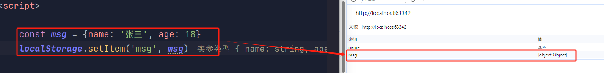
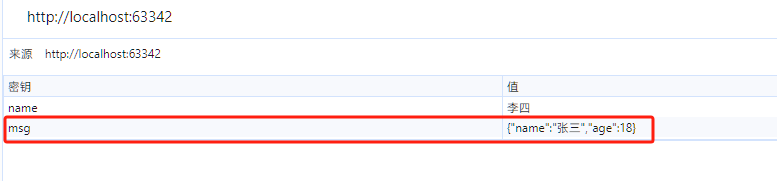
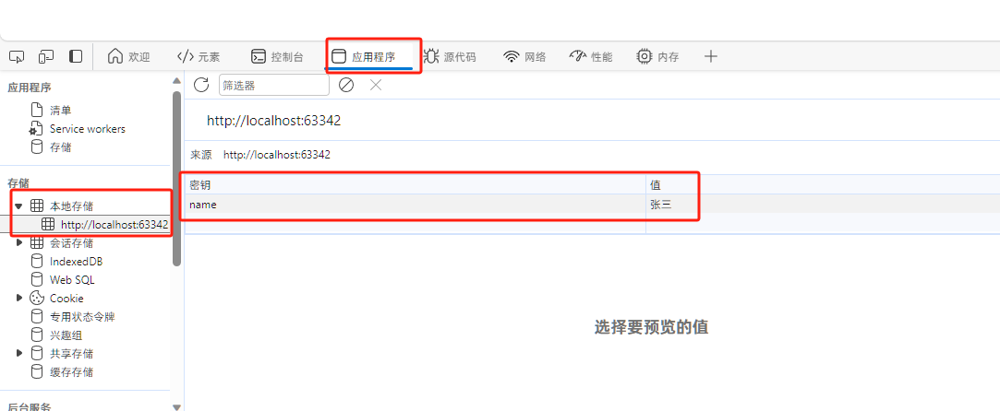

# Local Storage


作用：可以将数据永久存储在本地(用户浏览器中)，除非手动删除，否则关闭页面也会存在

特性：

- 可以多窗口共享
- 以键值对形式存储使用

::: details 与 Session Storage 区别

Session Storage

- 生命周期为关闭浏览器窗口 :disappointed:
- 在同一个窗口下数据共享
- 以键值对的形式存储使用
- 与 local storage 用法基本相同

:::


## 增/改

如果数据不存在，则会新增，如果数据存在，则会修改

```javascript
localStorage.setItem(key, value)
```


::: danger 只能存储字符串

本地存储，只能存储字符串类型

如果存储对象，会被转为字符串的 [object]



**所以，在使用时，如果要存储对象类型，一定要转一下格式，可以转为 json 字符串进行存储**

```javascript
const msg = {name: '张三', age: 18}
localStorage.setItem('msg', JSON.stringify(msg))
```



:::


**示例**

``` javascript
localStorage.setItem('name', '张三')
```




## 删

### 按key删除

```javascript
localStorage.removeItem('name') // 按 key 删除
```

### 清空

```javascript
localStorage.clear()    // 清空
```

## 查

如果存在，则会取出数据

如果不存在，则为 `null`

```javascript
console.log(localStorage.getItem('name'))   // 张三
console.log(localStorage.getItem('age'))    // null
```