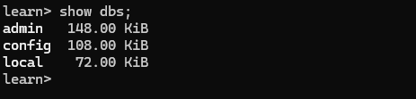
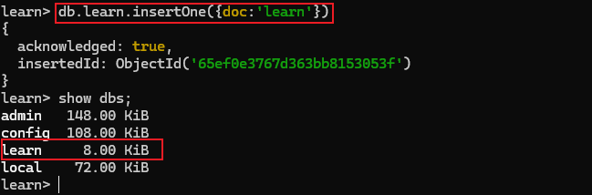
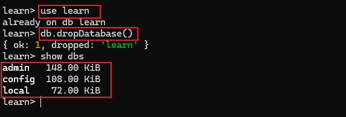

# 数据库管理

## 创建数据库

> [!note] 语法
>
> ``` bash
> use DATABASE_NAME
> ```
>
> 如果数据库不存在，则创建数据库，否则切换到指定数据库

创建 `learn` 数据库

``` bash
# 创建 learn 数据库
use learn

# 查看当前数据库
db
```

## 查看所有数据库

``` bash
show dbs;
```




> [!warning] 注意
>
> 请确保当前为 `管理员` 登录才可展示所有数据库。
>
> 可以看到，我们刚刚创建的 `learn` 不存在列表中，要显示它，需要向 `learn` 数据库插入一些数据




## 删除数据库

> [!note] 语法
>
> ``` bash
> db.dropDatabase()
> ```

``` bash
# 1. 切换到要删除的数据库
use learn

# 2. 删除数据库
db.dropDatabase()
```



