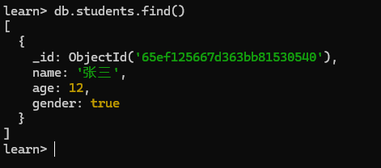

# 新增文档

## db.col.insertOne()

::: details 语法

``` javascript
db.collection.insertOne(<document>)
```

参数

- `document`：要插入到集合中的文档。

返回

- `acknowledged`：是否执行
- `insertedId`：插入的 `_id`

:::


向 `students` 集合中，新增一个文档

``` javascript
db.students.insertOne( // [!code focus:3]
    {name:'张三',age:12,gender:true}
)

# output
{
  acknowledged: true,,	# 是否执行
  insertedId: ObjectId('65ef15de67d363bb81530543')	# 插入的 _id
}
```


::: details 查看所有文档

``` javascript
db.col.find()
```



:::

## db.col.insertMany()

::: details 语法

``` javascript
db.collection.insertMany(
   [ <document 1> , <document 2>, ... ],
   {
      ordered: <boolean>
   }
)
```

参数

- `document`：要插入到集合中的文档数组。

- `ordered`：一个布尔值，指定 `mongod` 实例应执行有序插入还是无序插入。默认为 `true` 。

返回

- `acknowledged`：是否执行
- `insertedIds`：插入的 `_id` 数组

:::

向 `students` 集合中，新增多个文档

```javascript
db.students.insertMany(  // [!code focus:5]
    [
        {name:'王五',age:16,gender:false},
        {name:'王六',age:0,gender:null}]
)

# output
{
  acknowledged: true,	# 是否执行
  insertedIds: {	# 插入的 _id 数组
    '0': ObjectId('65ef163867d363bb81530544'),
    '1': ObjectId('65ef163867d363bb81530545')
  }
}
```

> [!warning] 注意
>
> 这里传入的是一个数组。
>
> 在 `mongodb` 中，没有强制约束等条件，需要在 程序 中进行处理。

