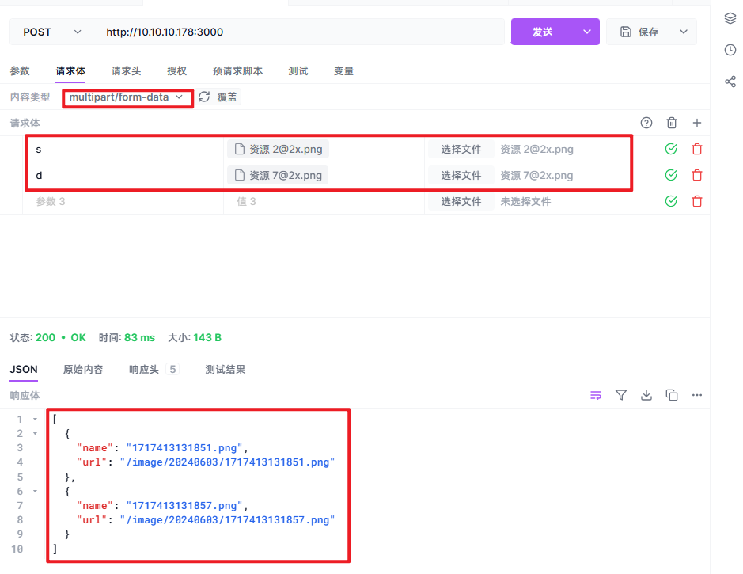

# 文件上传

- [参考](https://www.jianshu.com/p/5661f1511175)
- [koa-body npm官方](https://www.npmjs.com/package/koa-body)
- [扩展](https://github.com/node-formidable/formidable#filebegin)
  - `koa-body` 利用的是 `formidable`,是一个用于解析表单数据（尤其是文件上传）的 `Node.js` 模块。


## 设置静态目录

### 安装

文档：[koajs/static： 静态文件服务器中间件 (github.com)](https://github.com/koajs/static?tab=readme-ov-file)

```
npm install koa-static
npm i --save-dev @types/koa-static
```

### 配置

``` typescript
import Koa from "koa"
import koaBody from "koa-body"
import path from "path"
import serve from "koa-static"

const app = new Koa()	// [!code focus:3]
const router = new Router()
app.use(serve(path.join(__dirname, './static')))
```

>[!caution] 注意
>
>访问静态文件夹内容的时候

## 上传文件

### 安装

```bash
npm i koa-body	// 天然支持 js
```


### 配置

更多详细信息查看：[扩展](https://github.com/node-formidable/formidable#filebegin)

``` typescript
import Koa from "koa"
import koaBody from "koa-body"
import Router from "@koa/router"
import path from "path"
import moment from "moment" // npm i moment
import fs from 'fs'
import serve from "koa-static"

const app = new Koa()
const router = new Router()
app.use(serve(path.join(__dirname, './static')))	// 配置静态目录

app.use(koaBody({	// [!code ++]
    // 解析多部分正文	// https://www.npmjs.com/package/koa-body#options
    multipart: true,	// [!code ++]
    
    // 高级扩展，利用的是 formidable
    // https://github.com/node-formidable/formidable?tab=readme-ov-file#options
    formidable: {	// [!code ++]
        
        // 上传路径，高于此路径的前端不可显示
        uploadDir: path.join(__dirname, './static/image'),	// [!code ++]
        
        // 保留原始扩展名
        keepExtensions: true,		// [!code ++]
        
        // 最大10M
        maxFieldsSize: 10 * 1024 * 1024,	// [!code ++]
        
        // 自定义名称， name 为原名称， ext 为扩展名
        filename: (name, ext, part, form) => {	// [!code ++]
            const names = Date.now().toString()	// 这里把文件名称改为了 时间戳.扩展名	// [!code ++]
            return `${names}${ext}`	// [!code ++]
        },	// [!code ++]
        
        // 上传文件夹自定义，这样是每天为一个文件夹
        // 这里的 name 为上传时请求体名称 也就是请求体的 key。暂时不需要
        onFileBegin: (name, file) => {	// [!code ++]
            const dirName = moment(new Date).format('YYYYMMDD')	// 格式化时间用的 moment 包	// [!code ++]
            const dir = path.join(__dirname, `./static/image/${dirName}`)  // 拼接路径	// [!code ++]
            if (!fs.existsSync(dir)) {  // 检查是否已有路径	// [!code ++]
                fs.mkdirSync(dir)	// [!code ++]
            }	// [!code ++]
            // 覆盖原 filePath 即可
            file.filepath = `${dir}/${file.newFilename}`	// [!code ++]
            
             /**
             * 这里给 filepath 挂载一个 name 和 path 这样后面的请求就可以拿到
             * 为什么要挂载？ 
             * 虽然后面可以通过 filepath 拿到路径，但是，是全路径，并不是从 static 开始的路径
             * 为什么从 image 开始？
             * 因为挂载的文件夹是 static 所以访问时无须添加 static , localhost:3000/image/xxxx/xxx.jepg
             */
            
            //@ts-ignore
            file.path = `/image/${dirName}/${file.newFilename}`	// [!code ++]

            //@ts-ignore
            file.name = file.newFilename	// [!code ++]
        }
    }
}))
```


## 上传

``` typescript
router.post('/', (ctx: Koa.Context) => {

    /**
     * 获取文件
     * 这里获取的是一个对象
     * 对象的 key 为上传时的 key， value 为上传的文件
     */
    const files = ctx.request.files	// [!code focus:17]

    let result = []

    // 同时支持多文件和单文件上传
    if (files) {
        for (const key in files) {
            result.push({
                // @ts-ignore
                name: files[key].name,
                // @ts-ignore
                url: files[key].path
            })
        }
    }

    ctx.body = result
})
```

> [!warning] 注意
>
> 请求体的（名称 [下面的 s 和 d]）一定要带参数。带什么无所谓（因为后端没处理），但是得带。




