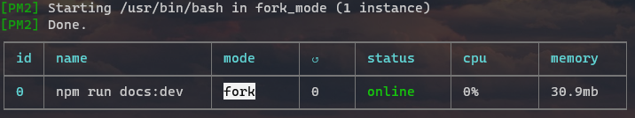

# 开始


官方文档：[PM2](https://pm2.keymetrics.io/docs/usage/quick-start/)

使用PM2，您可以在后台轻松启动/重启/重新加载/停止/列出应用程序。

## 启动

``` bash
pm2 start app.js
```



还可以启动任何类型的应用程序，如 bash命令、脚本、二进制文件：

```
pm2 start "npm run start"
pm2 start "ls -la"
pm2 start app.py
```

### 启动并日志流

``` bash
pm2 start api.js --attach
```

> [!tip] 提示
>
> 通过`Ctrl-C`退出时，应用程序仍将在后台运行。


### 传递参数

在 `--` 之后传递的所有选项都将作为参数传递给应用程序：

``` bash
pm2 start api.js -- 参数1 参数2
```


### 配置文件

当同时管理多个应用程序或必须指定多个选项时，可以使用配置文件。

生成配置文件

``` 
pm2 init
```

生态系统配置`js`文件：

``` javascript
module.exports = {
    apps: [{
        name: "limit worker",
        script: "./worker.js",
        args: "limit"
    }, {
        name: "rotate worker",
        script: "./worker.js",
        args: "rotate"
    }]
}
```

然后启动这两个应用程序：

``` 
pm2 start ecosystem.config.js
```


## 重新启动

重新启动应用程序：

```
pm2 restart app
```

要重新启动所有应用程序，请执行以下操作：

```
pm2 restart all
```

要一次重新启动多个应用程序，请执行以下操作：

```
pm2 restart app1 app3 app4
```


## 停止

要停止指定的应用程序，请执行以下操作：

```
pm2 stop api
pm2 stop [process_id]
```


要一次停止多个应用程序，请执行以下操作：

```
pm2 stop app1 app3 app4
```


## 删除

要停止和删除应用程序，请执行以下操作：

```
pm2 delete api
```

要全部删除：

```
pm2 delete all
```


### 重置重新启动计数

要重置重新启动计数器，请执行以下操作：

```
pm2 reset all
```


