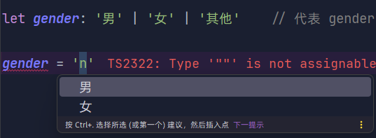

# 联合类型

联合类型`（union types）` 指的是多个类型组成的一个新类型，使用符号`|`表示。

联合类型`A|B`表示，任何一个类型只要属于`A`或`B`，就属于联合类型`A|B`。

## 声明

`string|number`，表示它的值既可以是字符串，也可以是数值。

```typescript
let y: number | string = 1 // [!code focus]
y = '1'	// 不会报错
```


## 值类型结合

表示一个变量的值有若干种可能。

```typescript
let setting: true | false   // 代表 setting 只有 true 或 false

let gender: '男' | '女' | '其他'    // 代表 gender 只有 男、女、其他
```


在使用赋值时，编译器会进行提示




## 多行书写

联合类型的第一个成员前面，也可以加上竖杠`|`，这样便于多行书写。

```typescript
let color:
    | 'red'
    | 'green'
    | 'blue'
    | 'grey'
    | 'black'
```