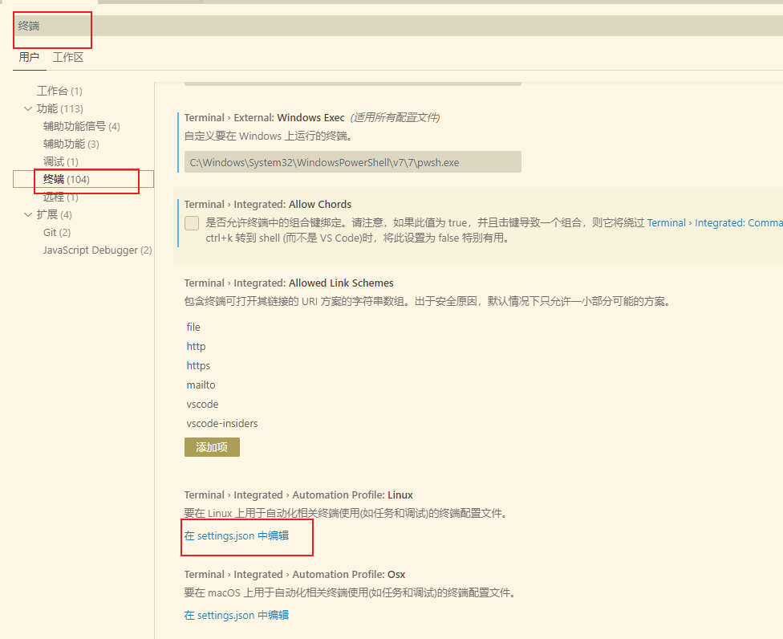
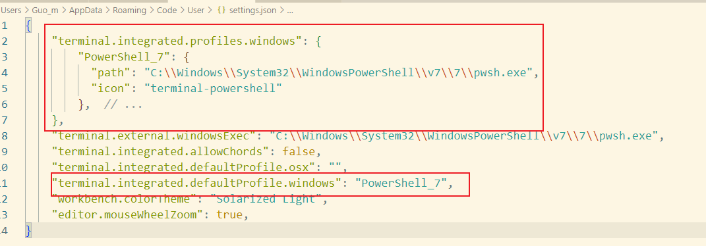

# powershell

## 安装位置

系统自带 `powershell` 安装位置在 `C:\Windows\System32\WindowsPowerShell\v1.0`

## vscode 配置

安装 `powershell7` 后 `vscode` 设置

- [参考](https://stackoverflow.com/questions/73845252/new-way-to-specify-powershell-7-in-visual-studio-code/77971795#77971795)

``` json
"terminal.integrated.profiles.windows": {
    "PowerShell_7": {
      "path": "C:\\Program Files\\PowerShell\\7\\pwsh.exe",     // 自定义安装的位置
      "icon": "terminal-powershell"
    },  // ...
}

```

- 第一步 

- 第二步，修改 `path` 后添加
