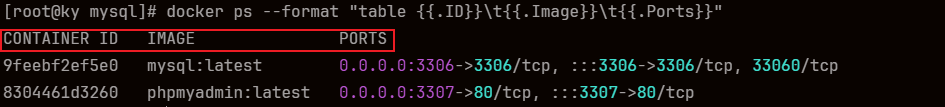
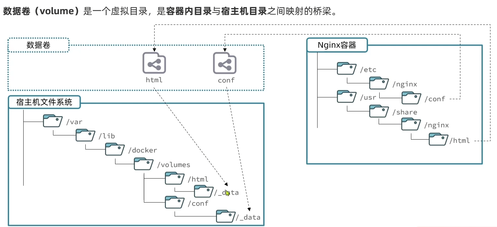

# 常用命令

常用命令及使用方法

官方文档（需代理）:[docker | Docker Docs](https://docs.docker.com/reference/cli/docker/)

## 系统命令

| 命令                       | 说明              |
| :------------------------- | :---------------- |
| `systemctl start docker`   | 启动 `docker`     |
| `systemctl stop docker`    | 停止 `docker`     |
| `systemctl restart docker` | 重启 `docker`     |
| `systemctl enable docker`  | 开启自启 `docker` |
| `docker -v`                | 查看版本          |

## 镜像命令

| 常用命令                 | 说明         |
| :----------------------- | :----------- |
| `docker images`          | 查看所有镜像 |
| `docker rmi 镜像名`      | 移除一个镜像 |
| `docker pull 镜像名:tag` | 拉取镜像     |
| `docker build`           | 创建镜像     |
| `docker push`            | 推送镜像     |
| `docker save`            | 导出镜像     |
| `docker load`            | 导入镜像     |

## 容器命令

| 常用命令                      | 说明                       | 补充                                            |
| :---------------------------- | :------------------------- | ----------------------------------------------- |
| `docker run`                  | 创建并运行一个容器         |                                                 |
| `docker start 容器名`         | 启动容器                   |                                                 |
| `docker stop 容器名`          | 停止容器                   |                                                 |
| `docker restart 容器名`       | 重启容器                   |                                                 |
| `docker rm 容器名`            | 删除容器                   | `docker rm -f 容器名`<br />强制删除运行中的容器 |
| `docker inspect 容器名`       | 查看容器详细信息           |                                                 |
| `docker ps`                   | 查看所有容器               |                                                 |
| `docker logs 容器名`          | 查看容器日志               |                                                 |
| `docker exec -it 容器名 bash` | 进入容器内部，执行一条命令 | `exit` <br />退出容器                           |

### docker run

``` bash
docker run --name mysql \
        -d \
        -p 3306:3306 \
        -e MYSQL_INITDB_SKIP_TZINFO=Asia/Shanghai \
        -e MYSQL_ROOT_PASSWORD=123456 \
        -v /docker/mysql:/var/lib/mysql \
        mysql:latest
```

- `--name`：给容器起一个名字，**必须唯一**
- `-d`：后台运行程序
- `-p`：端口映射，将*宿主机端口* 与 *容器* 端口进行映射。**左边**：宿主机，**右边**：容器
- `-e`：设置环境变量，`KEY=VALUE`
- `-v`：绑定数据卷，将*宿主机指定位置* 与 *容器* 指定位置进行映射。**左边**：宿主机，**右边**：容器
- `-it`：给当前进入的容器创建一个标准输入、输出终端，允许我们与容器交互。
- `--network 网桥名`：指定[网桥](#网络命令)

### docker logs

- `-f`：持续跟踪日志

### docker exec

``` bash
docker exec -it name bash
```

- `-it`：给当前进入的容器创建一个标准输入、输出终端，允许我们与容器交互。
- `name`：容器名称
- `bash`：命令工具

### docker ps

- `-a`：默认情况下，`docker ps` 输出的是运行中的容器，如果要展示所有容器，需要使用 `docker ps -a` 来进行查看

- `--format`：格式化输出，只输出指定的内容

    ``` bash
    docker ps --format "table {{.ID}}\t{{.Image}}\t{{.Ports}}"
    ```



## 数据卷命令



| 常用命令                       | 说明                            |
| :----------------------------- | :------------------------------ |
| `docker volueme create v-name` | 创建一个 `valume`               |
| `docker valume ls`             | 列出所有 `valume`               |
| `docker valume rm v-name`      | 删除一个或者多个指定的 `valume` |
| `docker volume inspect v-name` | 显示一个或多个`valume`的信息    |
| `docker valume prune`          | 删除未使用的 `valume`           |


## 网络命令

> [!info] 提示
>
> 加入自定义网络的容器才可以通过容器名相互访问
>
> 官方文档：[docker network | Docker Docs](https://docs.docker.com/reference/cli/docker/network/)

| 命令                        | 说明                 |
| --------------------------- | -------------------- |
| `docker network create`     | 创建一个网络         |
| `docker network ls`         | 查看所有网络         |
| `docker network rm`         | 删除指定网络         |
| `docker network prune`      | 清除未使用的网络     |
| `docker network connect`    | 使指定容器加入某网络 |
| `docker network disconnect` | 使指定容器离开某网络 |
| `docker network inspect`    | 查看网络详细信息     |


