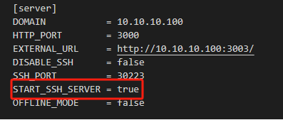

# 镜像

官方镜像库（需代理）:[Hub Docker](https://hub.docker.com/)

## mysql

``` bash
docker pull mysql:latest

docker run --name mysql \
        -d \
        -p 3306:3306 \
        -e MYSQL_INITDB_SKIP_TZINFO=Asia/Shanghai \
        -e MYSQL_ROOT_PASSWORD=123456 \
        -v /docker/mysql:/var/lib/mysql \
        mysql:latest --character-set-server=utf8mb4 --collation-server=utf8mb4_unicode_ci
```


## nginx

### Setp.1 拉取镜像

``` bash
docker pull nginx:lagest
```

### Setp.2 启动一次容器

``` bash
docker run --name nginx -d -p 80:80 nginx
```

### Setp.3 复制文件

1. 宿主机创建文件夹

    ``` bash
    mkdir /docker/nginx/logs			# 日志
    mkdir /docker/nginx/conf			# 配置
    ```

2. 复制文件到对应目录

    ``` bash
    # 复制项目文件
    docker cp nginx:/usr/share/nginx/html /docker/nginx
    
    # 复制配置文件
    docker cp nginx:/etc/nginx/nginx.conf /docker/nginx/conf/nginx.conf
    
    docker cp nginx:/etc/nginx/conf.d /docker/nginx/conf/conf.d
    ```

3. 删除当前容器

    ``` bash
    docker rm -f nginx
    ```

### Setp.4 重新创建容器

``` bash
docker run --name nginx \
        -d \
        -p 80:80 \
        -p 443:443 \
        -v /docker/nginx/conf/conf.d:/etc/nginx/conf.d \
        -v /docker/nginx/conf/nginx.conf:/etc/nginx/nginx.conf \
        -v /docker/nginx/html:/usr/share/nginx/html \
        -v /docker/nginx/logs:/var/log/nginx \
nginx
```


> [!warning] 警告
>
> 外网只能访问到开放的端口，上方的 80和443


## phpmyadmin

``` bash
docker pull phpmyadmin:latest

docker run --name phpmyadmin \
        -d \
        -e PMA_ARBITRARY=1 \
        -p 3307:80 \
        --restart=always \
phpmyadmin:latest
```

## alist

``` bash
docker pull xhofe/alist

docker run -d --name="alist" \
        --restart=unless-stopped \
        -v /mnt/sata1-5/docker/alist:/opt/alist/data \
        -p 5244:5244 \
xhofe/alist:latest


# 手动设置一个密码,`NEW_PASSWORD`是指你需要设置的密码
docker exec -it alist ./alist admin set NEW_PASSWORD
```


## gogs

``` bash
docker pull gogs/gogs

docker run -it --name=gogss \
        -p 30223:30223 \
        -p 3000:3000 \
        -v /mnt/sata1-5/docker/gogs:/data \
        --restart=always \
gogs/gogs
```


> [!warning] 注意
>
> - 如果 `ssh` 无法推送，则打开 `gogs/data/gogs/conf/app.ini`,将 `START_SSH_SERVER = fale` 改为 `true` 试试
>
>     
>
> - 安装时，`ssh` 端口要和`docker`创建外部映射以及内部自定义的端口一致，不然复制 `ssh` 地址会发生错误。
>
>     <span style="color:red;font-weight:bold;">因为复制的时候需要的是这个端口，外部无法使用22，因为宿主机占用了。所以外部映射端口地址和容器内部自定义端口地址要一致。</span>
>     
>     

 


## Portainer-ce

中文汉化版：[6053537/portainer-ce | Docker Hub](https://hub.docker.com/r/6053537/portainer-ce)

``` bash
docker pull 6053537/portainer-ce

docker run -d \
    --restart=always \
    --name="portainer" \
    -p 9000:9000 \
    -v /var/run/docker.sock:/var/run/docker.sock \
    -v /docker/portainer:/data \
6053537/portainer-ce
```


## Postgresql

### postgresql

镜像：[Postgres | Docker Hub](https://hub.docker.com/_/postgres)

``` bash
docker pull postgres

docker run \
--name postgres \
-v /mnt/sata1-5/docker/postgres:/var/lib/postgresql/data \
-p 5432:5432 \
-e POSTGRES_USER=root \				# 默认为 postgres
-e POSTGRES_PASSWORD=123456 \
-d \
postgres
```


### pgadmin

镜像：[elestio/pgadmin | Docker Hub](https://hub.docker.com/r/elestio/pgadmin)

``` bash
docker pull elestio/pgadmin

docker run --name pgadmin \
-e PGADMIN_DEFAULT_EMAIL=pgadmin@gmail.com \
-e PGADMIN_DEFAULT_PASSWORD=123456 \
-e PGADMIN_LISTEN_PORT=8080 \
-p 5433:8080 \
-d \
elestio/pgadmin
```


## chatgpt-next-web

- [ChatGPTNextWeb](https://github.com/ChatGPTNextWeb/ChatGPT-Next-Web)
- [GPT_API_free](https://github.com/chatanywhere/GPT_API_free?tab=readme-ov-file)

``` bash
docker pull yidadaa/chatgpt-next-web

docker run -d -p 3000:3000 \
   -e OPENAI_API_KEY=sk-xxxx \
   -e CODE=your-password \
   -e BASE_URL=https://api.chatanywhere.tech \
   yidadaa/chatgpt-next-web
```

`BASE_URL` 及` OPENAI_API_KEY` 可以通过 [GPT_API_free](https://github.com/chatanywhere/GPT_API_free?tab=readme-ov-file) 免费获得


## WARP-Clash-API

- [WARP-Clash-API](https://github.com/vvbbnn00/WARP-Clash-API)

该项目可以让你通过订阅的方式使用`WARP+`，支持`Clash`、`Shadowrocket`等客户端。

``` bash
docker pull vvbbnn00/warp-clash-api

docker run --name warp \
	-d \
	-p 3002:3000 \
	vvbbnn00/warp-clash-api
```


## 内网穿透隧道

文档：[文档 | frp (gofrp.org)](https://gofrp.org/zh-cn/docs/)

`github`：[fatedier/frp](https://github.com/fatedier/frp)

`frpc docker`：[snowdreamtech/frpc - Docker Image | Docker Hub](https://hub.docker.com/r/snowdreamtech/frpc)

`frps docker`：[hub.docker.com/r/snowdreamtech/frps](https://hub.docker.com/r/snowdreamtech/frps)


### frpc 客户端

::: code-group


```toml [toml 配置文件] {36-42}
# `frpc.toml` 配置文件

serverAddr = "x.x.x.x"	# server 地址
serverPort = 7000	# server 监听端口，与 frps 对应

webServer.addr = "0.0.0.0"	# web server 监听地址
webServer.port = 7500	# web server 端口
webServer.user = "admin"
webServer.password = "admin"

# token
# 只需要在 frp 的客户端 frpc 和服务端 frps 配置文件中配置相同的 token 即可。
auth.token = "token123456abcdefg"

# 配置 http 简单隧道，可以通过 服务器 ip:8080 来进行访问
[[proxies]]	 	
name = "web"
type = "http"
localPort = 80

# 配置 http 自定义域名隧道 01，可以通过 服务器 domain:8080 来进行访问
# 如果使用反代，反代地址为 *服务器ip:8080* 则可以使用 domain 进行访问
[[proxies]]
name = "web2"
type = "http"
localPort = 81
customDomains = ["www.domain.com"]

# 如果使用反代，同样反代地址为 *服务器ip:8080* 则可以使用 abc.domain1 进行访问 // [!code warning]
[[proxies]]
name = "web2"
type = "http"
localPort = 82
customDomains = ["abc.domain1.com"]

# 配置局域网内其他主机
[[proxies]]
name = "web3"
type = "http"
localIP = "10.10.10.102"
localPort = 83
customDomains = ["www.domain2.com"]
```


```shell [docker 运行]
docker run -d --name frpc \
	--restart=always \
    --network host \
    -v $PWD/frpc.toml:/etc/frp/frpc.toml \
    snowdreamtech/frpc
```

:::


> [!warning] 提示
>
> **多个服务自定义域名**
>
> - 后端通过解析域名来访问。
> - 如果使用 **反代** ，可在每个域名反代 `8080` 端口，通过 `frps` 自动进行分类。


### frps 服务端

::: code-group

```toml [toml 配置文件]
# `frpc.toml` 配置文件

bindPort = 7000		# 监听端口
vhostHTTPPort = 8080	# 出口，通过哪个端口提供访问

webServer.addr = "0.0.0.0"	# web server 监听地址
webServer.port = 7500	# web server 端口
webServer.user = "admin"
webServer.password = "admin"

# token
# 只需要在 frp 的客户端 frpc 和服务端 frps 配置文件中配置相同的 token 即可。
auth.token = "token123456abcdefg"
```


```shell [docker 运行]
docker run --name frps -d \
    --restart=always \
    --network host \
    -v $PWD/frps.toml:/etc/frp/frps.toml \
    snowdreamtech/frps
```

:::


## jupyter

更多内容查看：[jupyter lab](/tools/jupyterlab/jupyter#配置)

### 拉取镜像

```bash
docker pull jupyter/minimal-notebook
```

> [!CAUTION] 注意：需要设置一下当前目录的权限
>
> ```bash
> sudo chmod -R 777 $PWD
> ```

### 启动容器

```bash
docker run -d --name jupyter \
	-p 8000:8888 \
	--user root \
	-v $PWD:/home/jovyan \
	jupyter/minimal-notebook
```

### 设置密码

**进入 `jupyter` 容器，然后执行**

```
jupyter server list
```

**将会出现类似以下：**


**然后复制`token`粘贴在以下令牌部分，然后设置新密码**


