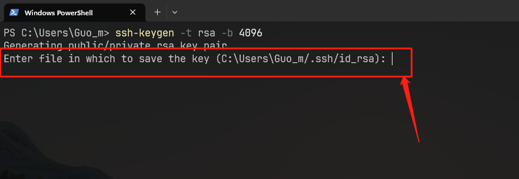
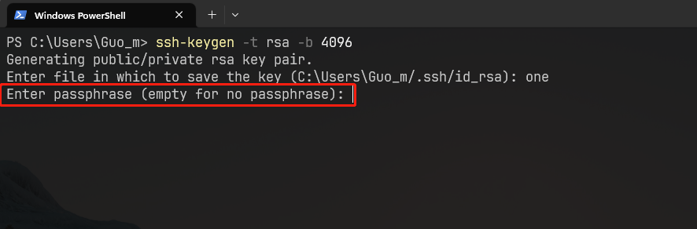
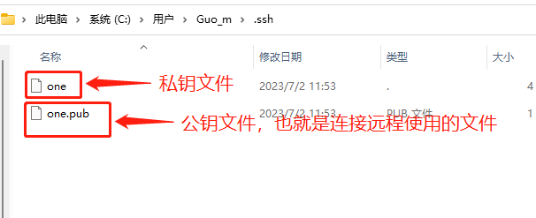
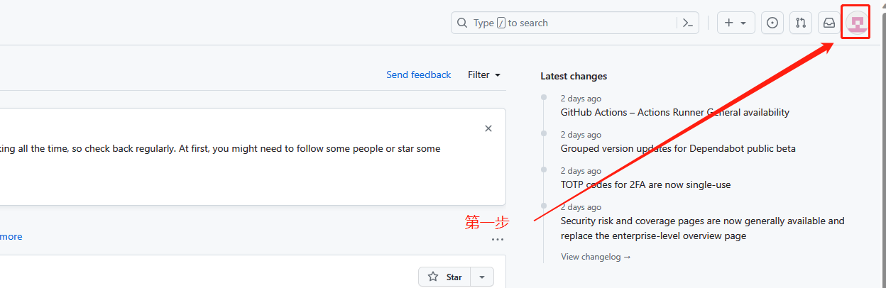
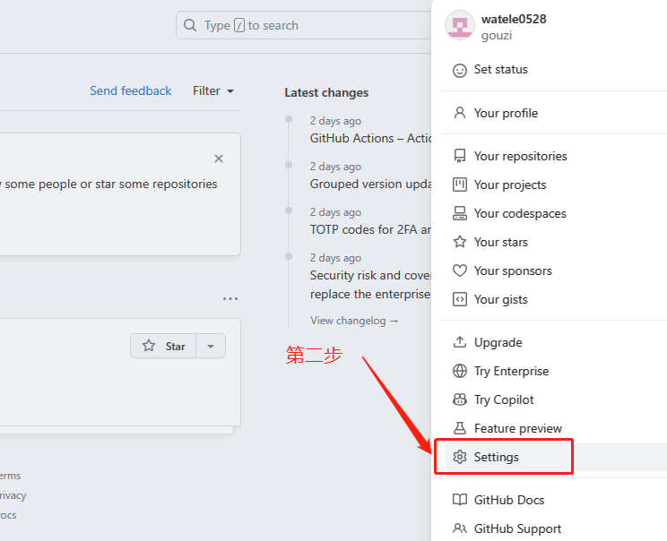
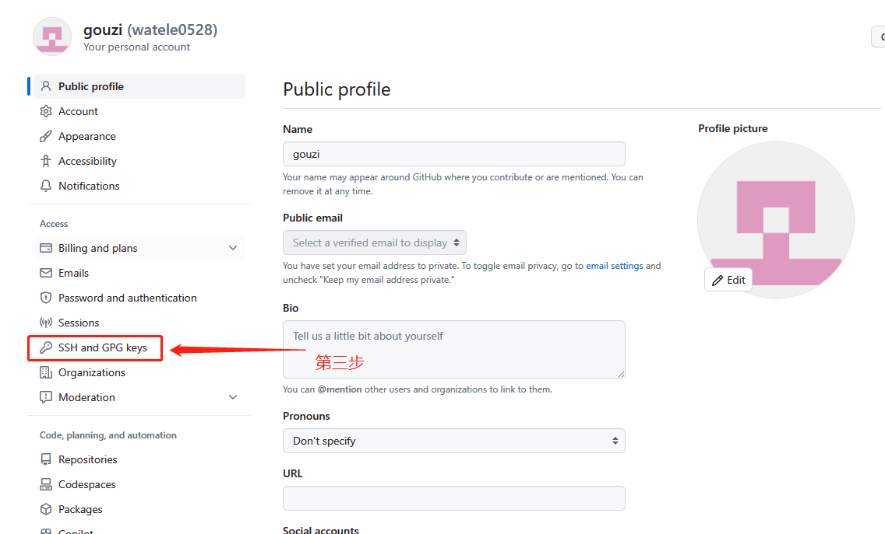
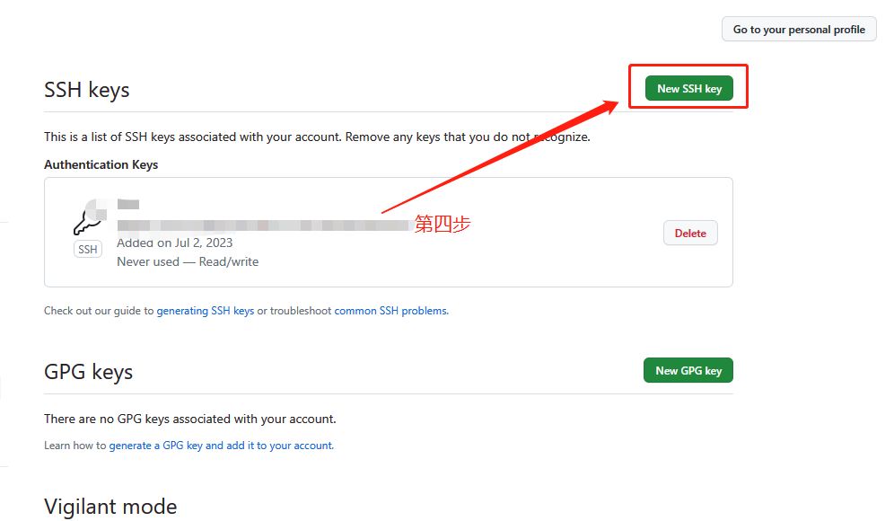
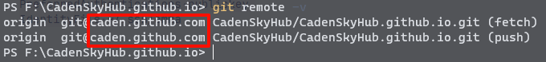
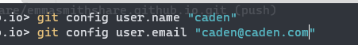
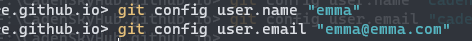

# 远程仓库

`git` 连接远程仓库

## 创建私钥

### step.1 生成秘钥

::: tip 管理秘钥

为了统一管理秘钥，在`用户`目录创建一个 .ssh 目录，进入 .ssh 目录进行创建秘钥。

:::

创建一个 ed25519 协议 的 大小为 4096 的秘钥文件

```sh
ssh-keygen -t ed25519 -b 4096
```
关于 sra 秘钥的问题：[windows最新`open-ssh`版本不支持rsa](https://blog.csdn.net/feiyanaffection/article/details/124469985)

::: details 注意

如果提示还是无法访问仓库，提示内容：`no matching host key type found. Their offer: ssh-rsa`

尝试在 `config` 中添加这个

``` 
Host *
HostkeyAlgorithms +ssh-rsa 
PubkeyAcceptedAlgorithms +ssh-rsa
```

:::


**输入协议名称**



**输入密码（可为空）：**




### step.2 查看秘钥

生成密钥结束后，在当前目录（也就是生成秘钥的目录）会生成两个文件




### step.3 设置秘钥

在 `.ssh` 文件夹中新建一个 `config` 文件

意思是：当我们访问 github 的时候，指定 SSH 使用特定秘钥

::: info
如果多个代码托管平台使用一个秘钥。则这个可以不设置，但是如果有多个代码托管平台，且每个托管平台都设置不同的秘钥，则就需要这个文件了
:::

```
# github
Host github.com				# github 服务器地址，Host和HostName 尽量一致
HostName github.com			# github 服务器名称，Host和HostName 尽量一致
PreferredAuthentications publickey
IdentityFile ~/.ssh/one		# 指定 github 的私钥位置
```


## github

- 右上角个人中心 → Seetings → SSH and GPG keys → SSH keys
- 将 `.dep` 公钥文件的内容粘贴到这里












### 关联本地仓库

**添加一个远程仓库**

- `sortname` : 基本上都使用 `origin`， 远程仓库别名
- `url` : 仓库地址

```shell
git remote add <sortname> <url>

例：git remote add origin git@github.com:watele0528/watele0528.github.io.git
```


### 推送

**第一种情况。本地与远程主分支名称相同**

```sh
git push -u orgin main
```


**第二种情况。本地与远程分支名称不同**

- 如果本地仓库主分支为 `master`， 则推送时，应该这么写：

    ``` sh
    git push -u origin master:main
    ```

- 或者，将本地主分支改为 main

    ``` sh
    git branch -M master main
    ```

    - 推送

        ``` sh
        git push -u origin main
        ```
### 推送分支到仓库
``` sh
git push -u origin 分支名
```


### 拉取

``` sh
git pull
```


### 查看远程分支关联

```shell
git remote -v
```


## 多个 github 账户

[参考](https://engineeringfordatascience.com/posts/how_to_manage_multiple_git_accounts_on_the_same_machine/)

```
Host caden.github.com		// Host 需要区分一下。也可以直接写成 caden
HostName github.com			// 不用动
PreferredAuthentications publickey
IdentityFile ~/.ssh/caden	// 该账户的key位置要正确

Host emma.github.com		// Host 需要区分一下,也可以直接写成 emma
HostName github.com			// 不用动
PreferredAuthentications publickey
IdentityFile ~/.ssh/emma	// 该账户的key位置要正确
```


### 注意点一

 `caden` 账户的 `github`



`emma` 账户的 `github`


> [!CAUTION] 注意
>
> 不同地址的 `git remote 的地址` 要和 `config Host` 相对应


### 注意点二

尽量在不同的项目来配置不同的 `user.name` 和 `user.email`

::: details caden



:::


::: details emma



:::

## 多平台
```
Host caden
HostName github.com
PreferredAuthentications publickey
IdentityFile ~/.ssh/caden


Host emma
HostName github.com
PreferredAuthentications publickey
IdentityFile ~/.ssh/emma


Host 10.10.10.10
HostName 10.10.10.10
PreferredAuthentications publickey
IdentityFile ~/.ssh/home
```
> [!CAUTION] 注意！
> 这里建议 HOST 和 HostName 写一样的。 [参考](https://blog.csdn.net/qq_41836702/article/details/131192581)

**参数解析**
1. `Host 10.10.10.10`：这个参数指定了一个特定的 SSH 主机名称。在这里，它是 IP 地址 10.10.10.10 的简称，可以用来代替 IP 地址进行 SSH 连接。
2. `HostName 10.10.10.10`：这个参数指定了 SSH 客户端应该连接到的实际主机的地址。它在 Host 名称被解析成具体 IP 地址或 DNS 名称时起作用。如果两者相同，通常可以省略这个设置。
3. `PreferredAuthentications publickey`：这个参数决定了 SSH 客户端在登录过程中尝试使用的首选认证方式。在这里，它是设置为 publickey，这意味着客户端优先尝试使用公钥进行身份验证。这种方法比传统的密码验证更安全。
4. `IdentityFile ~/.ssh/home`：这个参数指定了 SSH 客户端应该用于连接的私钥文件路径。在这里，它是 ~/.ssh/home，这意味着客户端会尝试在该目录下找一个名为 "home" 的私钥文件。如果找到该文件，并且可以正确解析公钥，客户端将使用它来进行身份验证。
