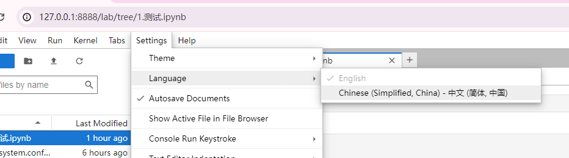

# Jupyter Lab

## 安装

进入要安装 `jupyterlab` 的环境，然后执行

```
conda install jupyterlab
```


## 启动

```
jupyter lab
```


## 配置

> [!WARNING] 注意
>
> 在配置前，应先生成 `` 配置文件
>
> ```bash
> jupyter lab --generate-config
> ```
>
> 生成完成后，将会告诉你生成的目录
>
> 


可以直接在顶部设置，这样就不用找相关设置取消 `#` 注释了

```python
c.ServerApp.ip = '0.0.0.0'
c.ServerApp.allow_origin = '*'
c.ServerApp.notebook_dir = '/mnt/f/jupyter'
c.ServerApp.open_browser = False
c.NotebookApp.terminado_settings = {"shell_command":["/bin/bash"]}
```

> [!CAUTION] 注意
> `WSL2` 宿主机不可以通过 `ip` 访问，只能通过 `127.0.0.1` 来访问


### 切换监听端口

编辑配置文件，修改：

```python
# c.ServerApp.port = '8888' // [!code --]
c.ServerApp.port = '8888'  # 允许所有来源 // [!code ++]
```


### 切换监听地址

编辑配置文件，修改：

```python
# c.ServerApp.ip = 'localhost'	// [!code --]
c.ServerApp.ip = '0.0.0.0'	# 注意 windows 防火墙是否关闭 // [!code ++]
c.ServerApp.allow_origin = '*'  # 允许所有来源 // [!code ++]
```


### 修改默认文件夹

编辑配置文件，修改：

```python
# c.ServerApp.notebook_dir = '' // [!code --]
c.ServerApp.notebook_dir = '/mnt/f/jupyter'
```


### 关闭自动打开浏览器

编辑配置文件，修改：

```python
# c.ServerApp.open_browser = True // [!code --]
c.ServerApp.open_browser = False  # // [!code ++]
```

### 切换 lab terminal 为 bash

[参考](https://blog.csdn.net/weixin_39885358/article/details/127869634)

编辑配置文件，修改：

```python
# c.NotebookApp.terminado_settings = {} // [!code --]
c.NotebookApp.terminado_settings = {"shell_command":["/bin/bash"]}  # // [!code ++]
```


## 设置中文

在安装 `jupyter lab` 的环境中运行

> [!WARNING] 为什么使用 pip?
>
> 因为使用 `conda` 会出现 `PackagesNotFoundError` 的问题，通常是因为该包不在默认通道中。

```bash
pip install jupyterlab-language-pack-zh-CN
```




## 切换内核

### 安装

```
pip install ipykernel
```

> [!INFO] 提示
>
> 其实完成这一步就可以切换了。如果不行再执行下面的。

### 添加

```
python -m ipykernel install --user --name=envName
```

::: details -m

指示 `Python` 解释器要以模块的方式运行后面的模块名。

:::

> [!CAUTION] 注意!
>
> - 完成后重启一下 `jupyter lab`。
>
> - 或者执行下方操作也可以
>
> 


### 检查

```python
import sys

print(sys.version)
```


### 查看

这会列出所有内核

```
jupyter kernelspec list
```

### 删除

删除一个内核

```
jupyter kernelspec remove envName
```

## PM2 执行

`ecosystem.config.js` 文件配置

``` js
module.exports = {
  apps : [{
    name:'jupyter',
    script: 'bash',
    args:['-c', 'source ~/Miniconda/etc/profile.d/conda.sh && conda activate jupyter && jupyter lab']   // 注意 Miniconda 的路径
  }]
};

```


